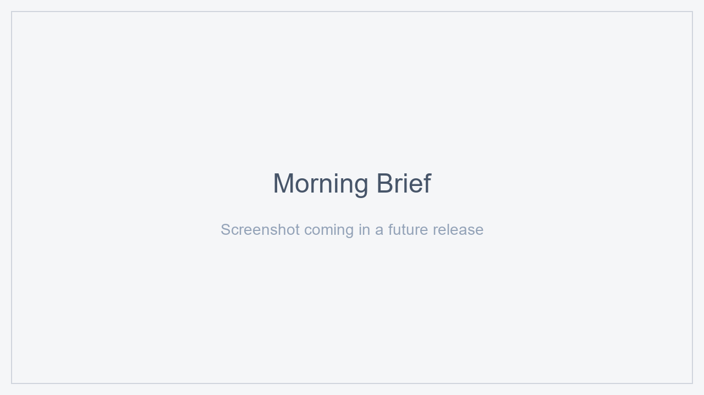

# Morning Brief

> AI-narrated daily / evening / weekly briefs for Home Assistant, built from your own sensors and calendars.

[](https://hacs.xyz/)
[](https://github.com/machintrucbidule/ha-morning-brief/actions/workflows/tests.yml)
[](https://github.com/machintrucbidule/ha-morning-brief/actions/workflows/hacs-validate.yml)
[](LICENSE)



## 1. What is it?

Morning Brief is a Home Assistant custom integration that produces a canonical JSON document summarising your day — what happened, what is anomalous, what to expect — and lets an AI narrate it. The output is consumed by the companion [`ha-morning-brief-card`](https://github.com/machintrucbidule/ha-morning-brief-card) Lovelace card, or by any automation/notification of your choice.

Three report types: **morning**, **evening**, **weekly**. Each is an independent instance with its own fields, categories, AI provider, trigger, and persistence.

## 2. Features

- 8 field provider types: `cumulative`, `instantaneous`, `event_based`, `state`, `duration`, `calendar`, `weather`, `manual`
- 8 comparison types per field: yesterday, same-weekday-last-week, rolling avg/min/max, target, trend, same-week-last-year
- 3 anomaly modes per field: z-score, static threshold, percent-change-vs-rolling-avg
- 3 logical-day strategies: fixed cutoff, sleep sensor, manual
- 4 AI provider backends: HA `ai_task`, Anthropic direct, OpenAI direct, disabled
- Multilanguage (FR + EN), instance language override
- Native HA UI for every config step (subentries for fields and categories)
- FIFO history (configurable 5–365 briefs)
- Persistent canonical JSON exposed via sensor entity + service

## 3. Requirements

- Home Assistant Core ≥ 2024.11 (subentries + `ai_task` APIs)
- HACS installed (recommended) or manual install
- Optional: an `ai_task.*` entity (Google Generative AI, OpenAI Conversation, Anthropic) **or** an API key for Anthropic/OpenAI

## 4. Installation

### Via HACS (recommended)

1. HACS → Integrations → ⋮ → Custom repositories
2. Add `https://github.com/machintrucbidule/ha-morning-brief`, category **Integration**
3. Install **Morning Brief**, restart Home Assistant
4. Settings → Devices & Services → Add Integration → **Morning Brief**

### Manual

Copy `custom_components/morning_brief/` into your HA `config/custom_components/`, restart, then add the integration via the UI.

## 5. Quickstart

After **Add Integration → Morning Brief**:

1. Pick **Report type** (morning / evening / weekly) and **Language**
2. Choose a **Logical-day strategy** (default `fixed_cutoff` at 04:00 is a sensible start)
3. Pick a **Trigger level** (start with L1 / schedule)
4. Choose an **AI provider** (start with `disabled` if you want to see the brief first, then enable AI later)
5. Open the new device, then **Add subentry → Field** to wire your first sensor
6. Press the **Generate** button on the device — your sensor `sensor.morning_brief_<instance>` is populated

## 6. Concepts

### Reports

A *report* is one instance of the integration: it ships with its own config entry, sensor entity, button entity, and stored briefs. Three reports are supported; you can install all three if you want morning + evening + weekly.

### Fields

A *field* is a binding between a Home Assistant entity and a provider type. Each field belongs to a category and declares its comparisons + anomaly mode. Fields are created as subentries via **Add subentry → Field** on the device page.

### Categories

A *category* groups fields visually (e.g. *Énergie*, *Bien-être*, *Maison*). Custom icon and color per category.

### Logical day

The "day" of a brief is not always the calendar day. Morning briefs at 06:00 still refer to yesterday's data; sleep-tracker-based instances can shift further. See [`docs/architecture.md`](docs/architecture.md).

### AI envelope

When AI is enabled, the model receives a stripped-down prompt and replies with a JSON envelope: `insights`, `weather_synthesis`, `verdict`. On AI failure the brief is still produced (`ai_status: degraded`) — no crash.

## 7. Configuration overview

| Step | What you configure |
|---|---|
| Report type | morning / evening / weekly |
| Language | fr / en (override of `hass.config.language`) |
| Logical day | strategy + parameters |
| Trigger | L1 (schedule) / L2 (sensor) / L3 (service only) |
| AI provider | ha_ai_task / anthropic_direct / openai_direct / disabled |
| Notifications | optional, with clickAction URL |
| Persistence | history cap (5–365), default 30 |

All steps are revisitable via **Options** on the device page.

## 8. AI providers

See [`docs/ai_providers.md`](docs/ai_providers.md). Quick guidance:

- **Start with `disabled`** to verify your fields produce sensible data
- **Use `ha_ai_task`** if you already configured Google Generative AI / OpenAI Conversation / Anthropic Conversation in HA
- **Use `anthropic_direct` / `openai_direct`** only if you want to keep the integration's AI traffic separate from any conversational use, or if `ai_task.*` isn't available on your version

API keys are stored unencrypted in `config_entry.data` per HA convention. See `secrets.yaml` for indirection.

## 9. Field providers

See [`docs/providers.md`](docs/providers.md) for the full decision tree. Quick reference:

| Provider | Best for |
|---|---|
| `cumulative` | Daily energy / water counters that only grow |
| `instantaneous` | Sensors read at brief time (temperature, humidity) |
| `event_based` | Counting distinct events (door openings) |
| `state` | Snapshot of a categorical state |
| `duration` | Total time a sensor spent in a given state |
| `calendar` | Today's events from a `calendar.*` entity |
| `weather` | A forecast item + current observation |
| `manual` | You enter the value via a service call |

## 10. Comparisons

Each field can opt-in to up to 8 comparison types. Defaults: yesterday + same-weekday-last-week + rolling-avg-14. See [`docs/architecture.md`](docs/architecture.md#comparisons).

## 11. Anomaly detection

Per field: `none` / `z_score` / `static_threshold` / `pct_change_vs_rolling_avg`. Severity tiers `info / warning / critical` map to the alert banner in the card.

## 12. Triggers

Three levels — see [`docs/triggers.md`](docs/triggers.md). Blueprints shipped for L1 and L2:

- `blueprints/automation/morning_brief/trigger_on_schedule.yaml`
- `blueprints/automation/morning_brief/trigger_on_wake.yaml`

For L3 (external trigger), see [`docs/examples/automation_level3_external_trigger.yaml`](docs/examples/automation_level3_external_trigger.yaml).

## 13. Services

| Service | Use |
|---|---|
| `morning_brief.generate` | Generate a brief (respects throttle unless `force: true`) |
| `morning_brief.preview` | Generate without persisting (for testing) |
| `morning_brief.advance_day` | Manual logical-day strategy: move forward to the next day |
| `morning_brief.clear_history` | Wipe stored briefs for one instance |
| `morning_brief.test_ai_provider` | Round-trip the configured AI provider with a mock payload |
| `morning_brief.get_last_brief` | Return the full canonical JSON (used by the card past the 16 KB cap) |
| `morning_brief.get_brief_by_uuid` | Return a historical brief from the FIFO |
| `morning_brief.reorder_fields` | Persist a new field order (used by the options flow) |

## 14. Events

- `morning_brief_generated` — fired after a successful generation, payload includes `entry_id`, `brief_uuid`, `report_type`
- `morning_brief_ai_failed` — fired when all AI retries fail; brief is still produced in degraded mode

## 15. Entities

- `sensor.morning_brief_<instance>` — main entity, exposes the canonical JSON in attributes (truncated past 16 KB; full JSON via `get_last_brief`)
- `sensor.morning_brief_<instance>_status` — lightweight status (last generation time, `ai_status`, brief count)
- `button.morning_brief_<instance>_generate` — manual trigger
- `button.morning_brief_<instance>_preview` — manual preview (does not persist)

## 16. Lovelace card

Install the companion card from [`ha-morning-brief-card`](https://github.com/machintrucbidule/ha-morning-brief-card) (HACS Frontend → custom repositories). YAML examples ship in [`docs/examples/lovelace_basic.yaml`](docs/examples/lovelace_basic.yaml) and [`docs/examples/lovelace_compact.yaml`](docs/examples/lovelace_compact.yaml).

## 17. Multilanguage

Two languages at launch: FR + EN. Instance language is auto-detected from `hass.config.language` and is overridable. See [`docs/multilanguage.md`](docs/multilanguage.md) for adding a new language.

## 18. Troubleshooting

- **Brief shows `—` everywhere** — your fields probably reference entities that don't exist. Open the device → **Options → Fields** and verify each entity_id.
- **`ai_status: degraded` after every generation** — the AI provider can't reach the API or the JSON envelope failed validation. Try `morning_brief.test_ai_provider` and check the logs.
- **`status: insufficient_history` on a comparison** — the sensor doesn't have enough days of history (or LTS) to satisfy the window. Either reduce the window or wait for history to accrue.
- **Sensor attributes show `_truncated: true`** — the canonical JSON exceeded 16 KB. The card handles this transparently via `morning_brief.get_last_brief`. Other consumers should do the same.

## 19. Development

```sh
git clone https://github.com/machintrucbidule/ha-morning-brief
cd ha-morning-brief
pip install -e .[dev]
pytest
ruff check .
mypy --strict custom_components/morning_brief
```

CI runs the same on every push: pytest + ruff + mypy + HACS Validate.

## 20. License

MIT — see [LICENSE](LICENSE).
